Viewed double_ratchet.dart:235-258
Viewed j:\Projects\helix\backend\lib\src\modules\admin_pairing.dart:56-91
Listed directory helix
Listed directory helix_remote
Viewed admin_pairing.dart:50-95
Viewed server_impl.dart:520-560
Viewed server_impl.dart:455-485
Viewed phone_otp.dart:95-130
Viewed phone_otp.dart:75-105
Viewed attachments.dart:365-450
Viewed AndroidManifest.xml:1-75
Searched for files: *CallForegroundService*
Viewed CallForegroundService.kt:1-60
Viewed sync_engine.dart:90-140
Viewed sync_engine.dart:195-250
Viewed runtime.dart:135-165
Searched for "handleRealtimeGap"
Viewed remote_runtime_coordinator.dart:150-180
Viewed remote_runtime_coordinator.dart:110-145
Viewed remote_runtime_coordinator.dart:180-215
Viewed remote_runtime_coordinator.dart:50-90
Viewed backups_repository.dart:40-140
Viewed backups_repository.dart:145-200
Viewed backups_repository.dart:250-320
Viewed backups_repository.dart:320-350
Viewed crypto_repository.dart:1-60
Viewed double_ratchet.dart:380-430
Viewed double_ratchet.dart:350-385
Viewed double_ratchet.dart:235-270
Viewed s2s_module.dart:85-130
Viewed s2s_module.dart:30-85
Searched for "/s2s/"
Viewed server_impl.dart:640-745
Viewed s2s_module.dart:500-540
Searched for "BEGIN TRANSACTION"
Viewed accounts_devices_repository.dart:800-835
Viewed accounts_devices_repository.dart:870-910
Viewed j:\Projects\helix\helix_remote\backend\lib\src\database\database.dart:2-76
Searched for files: *database*
Viewed database.dart:1-58
Viewed contacts.dart:480-525
Viewed contacts.dart:370-415
Viewed contacts.dart:100-140
Searched for "discovery-salt"
Searched for "discovery-salt"
Viewed contacts.dart:35-70
Viewed contacts.dart:65-85
Viewed j:\Projects\helix\helix_remote\backend\lib\src\modules\directory_server.dart:2-76
Searched for files: *directory*
Viewed directory_server.dart:1-85
Viewed directory_server.dart:85-130
Viewed websocket.dart:200-240
Viewed websocket.dart:310-365
Searched for files: *message_crypto*
Viewed message_crypto.dart:1-75
Viewed message_decryption.dart:195-235
Viewed lifecycle.dart:1-60
Searched for "group"
Searched for "GroupSenderChain"
Viewed group_service.dart:50-95
Searched for "RemoteGroupService("
Viewed lifecycle.dart:220-250
Searched for "group_epoch_keys"
Viewed groups_repository.dart:55-95
Viewed migrations.dart:1-60
Viewed migrations.dart:400-470
Searched for files: *history_receipts*
Viewed history_receipts.dart:1-60
Viewed history_receipts.dart:60-120
Searched for files: *invite*
Viewed invites.dart:1-60
Viewed invites.dart:60-120

# Helix Remote: Principal Refactoring Implementation Roadmap

This implementation roadmap translates the findings from the comprehensive audit into a strict, minimal-effort, high-return engineering sequence. It operates under two hard constraints:
1. **Zero ground-up rewrites**: All changes preserve the existing architecture, Shelf modular backend, Flutter/Isolate client runtimes, and protocol contracts.
2. **Maximum ROI prioritization**: Prioritizes fixes where minimal line modifications eliminate catastrophic security holes, state loss, or concurrency crashes.

---

## 1. File Return-on-Investment (ROI) Heatmap

Ranked by $\text{ROI} = \frac{\text{Severity Score (1-10)} \times \text{Blast Radius}}{\text{Lines Modified} \times \text{Regression Risk (1-5)}}$:

| Rank | Target File | Impact / Root Cause Mitigated | LOC Changed | Regression Risk | ROI Score |
| :--- | :--- | :--- | :---: | :---: | :---: |
| **1** | [`admin_pairing.dart`](file:///j:/Projects/helix/helix_remote/backend/lib/src/modules/admin_pairing.dart) & [`server_impl.dart`](file:///j:/Projects/helix/helix_remote/backend/lib/src/server_impl.dart) | Remote admin takeover via reverse-proxy loopback trust & IP spoofing | 12 | Minimal (1) | **99** |
| **2** | [`phone_otp.dart`](file:///j:/Projects/helix/helix_remote/backend/lib/src/modules/auth/phone_otp.dart) | Unauthenticated account takeover via plaintext OTP leakage in JSON | 6 | Minimal (1) | **98** |
| **3** | [`attachments.dart`](file:///j:/Projects/helix/helix_remote/backend/lib/src/modules/attachments.dart) | Unbounded disk exhaustion DoS during file stream uploads | 14 | Low (2) | **94** |
| **4** | [`AndroidManifest.xml`](file:///j:/Projects/helix/helix_remote/app/android/app/src/main/AndroidManifest.xml) | Instant crash on Android 14 (API 34) on incoming VoIP call | 4 | Minimal (1) | **92** |
| **5** | [`backups_repository.dart`](file:///j:/Projects/helix/helix_remote/packages/helix_remote_storage/lib/src/database/backups_repository.dart) | Permanent message history decryption failure on backup restore | 18 | Low (2) | **90** |
| **6** | [`double_ratchet.dart`](file:///j:/Projects/helix/helix_remote/packages/helix_remote_crypto/lib/src/double_ratchet.dart) | Out-of-order message loss due to mis-indexed skipped keys | 12 | Low (2) | **88** |
| **7** | [`database.dart`](file:///j:/Projects/helix/helix_remote/backend/lib/src/database.dart) & [`accounts_devices_repository.dart`](file:///j:/Projects/helix/helix_remote/backend/lib/src/database/accounts_devices_repository.dart) | Concurrent `SqliteException: cannot start a transaction within a transaction` | 28 | Medium (2) | **86** |
| **8** | [`sync_engine.dart`](file:///j:/Projects/helix/helix_remote/packages/helix_remote_sync/lib/src/sync_engine.dart) & [`remote_runtime_coordinator.dart`](file:///j:/Projects/helix/helix_remote/app/lib/app/remote_runtime_coordinator.dart) | Infinite desync loop & unawaited concurrent sync storm on sequence gaps | 32 | Medium (3) | **84** |
| **9** | [`lifecycle.dart`](file:///j:/Projects/helix/helix_remote/app/lib/app/composition_root/lifecycle.dart) | Group epoch key regeneration on every access causing decryption loss | 15 | Low (2) | **82** |
| **10** | [`s2s_module.dart`](file:///j:/Projects/helix/helix_remote/backend/lib/src/modules/s2s_module.dart) & [`directory_server.dart`](file:///j:/Projects/helix/helix_remote/backend/lib/src/directory_server.dart) | S2S federation identity spoofing & domain hijacking | 24 | Medium (2) | **79** |
| **11** | [`invites.dart`](file:///j:/Projects/helix/helix_remote/backend/lib/src/modules/auth/invites.dart) | Unauthenticated invite-code brute forcing | 12 | Low (1) | **75** |
| **12** | [`migrations.dart`](file:///j:/Projects/helix/helix_remote/packages/helix_remote_storage/lib/src/database/migrations.dart) | Silent database corruption via indiscriminate `catch (_)` in DDL | 16 | Low (2) | **72** |

---

## 2. Consolidated Systemic Root Causes & Execution Paths

```mermaid
flowchart TD
    subgraph RootCause1["Root Cause 1: Reverse-Proxy Trust Blindness"]
        A1["Public Client HTTP Request"] --> B1["Caddy Reverse Proxy (127.0.0.1)"]
        B1 --> C1["Shelf Server (connInfo.remoteAddress == 127.0.0.1)"]
        C1 -->|peer.isLoopback == true| D1["POST /api/v1/admin-pairing/generate succeeds"]
        C1 -->|Takes X-Forwarded-For.first| E1["Client-Spoofed IP Bypasses Rate Limiter"]
    end

    subgraph RootCause2["Root Cause 2: Sync Engine Gap Panic & Missing Concurrency Lock"]
        A2["WebSocket Push Sequence N+2"] --> B2["handleIncomingEnvelope: seq != lastSeq + 1"]
        B2 -->|Drops Event & Calls| C2["unawaited(handleRealtimeGap())"]
        C2 -->|Burst of 10 Drops| D2["10 Concurrent syncInbound() REST calls"]
        D2 -->|Raw BEGIN TRANSACTION;| E2["SqliteException: Transaction Collision / Crash Loop"]
    end

    subgraph RootCause3["Root Cause 3: Crypto Session Exclusion in Backup Engine"]
        A3["User Exports Backup"] --> B3["exportBackupSnapshot() omits crypto_sessions"]
        B3 --> C3["User Restores Backup on New Device"]
        C3 --> D3["_clearRestorableTables() wipes local state"]
        D3 --> E3["getOrCreateLocalHistorySessionSeed generates random seed"]
        E3 --> F3["All Restored Messages Fail Decryption (Total Data Loss)"]
    end
```



---

## 3. Implementation Batches

```
  Batch 1: Immediate Critical Security & Injection Gates
  ├── admin_pairing.dart (Block external loopback spoofing)
  ├── server_impl.dart (Strict client IP resolution & S2S trust)
  ├── phone_otp.dart (Strip plaintext OTP leakage)
  ├── attachments.dart (Streaming chunk threshold abort)
  └── AndroidManifest.xml (VoIP foreground service type declaration)
  
  Batch 2: Concurrency & Sync Engine Gap Hardening
  ├── database.dart (Add transaction<T> depth/savepoint manager)
  ├── accounts_devices_repository.dart (Migrate to database.transaction)
  ├── remote_runtime_coordinator.dart (Deduplicate in-flight sync calls)
  └── sync_engine.dart (Buffer out-of-order envelopes instead of crashing)

  Batch 3: Backup Engine & State Integrity Preservation
  ├── backups_repository.dart (Export and restore crypto_sessions)
  ├── lifecycle.dart (Persist and read group epoch keys via database)
  └── migrations.dart (Only ignore duplicate column exceptions)

  Batch 4: Cryptographic Session & Federation Fixes
  ├── double_ratchet.dart (Pass previous Dhp to skipped keys)
  ├── s2s_module.dart (Enforce registered domain matching on sender)
  ├── directory_server.dart (Reject domain re-registration by new keys)
  └── invites.dart (Add IP rate limiting to invite lookup)
```

---

## 4. Exact Code Replacement Instructions

### Batch 1: Immediate Critical Security & Injection Gates

#### Fix 1.1: Eliminate Reverse-Proxy Admin Bypass
- **Target File**: [`backend/lib/src/modules/admin_pairing.dart`](file:///j:/Projects/helix/helix_remote/backend/lib/src/modules/admin_pairing.dart#L58-L69)
- **Class / Method**: `AdminPairingModule._generate`
- **Execution Path**: Attacker $\to$ Caddy $\to$ Shelf `_generate` $\to$ `peer.isLoopback` checks Caddy's connection (`127.0.0.1`), generates code, and responds with code in HTTP body.
- **Root Cause**: `peer` is the immediate TCP socket address (reverse proxy), not the originating client IP.
- **Target Code**:
```dart
    final connInfo = request.context['shelf.io.connection_info'];
    final peer = connInfo is HttpConnectionInfo ? connInfo.remoteAddress : null;
    final isLoopback =
        peer != null &&
        (peer.isLoopback || peer.address == _dockerHostGateway());
    if (!isLoopback) {
      return _json({
        'error':
            'This endpoint only accepts connections from the server itself.',
      }, status: 403);
    }
```
- **Replacement Code**:
```dart
    // Require that the originating client IP (after proxy resolution) is loopback,
    // AND that the direct peer connection is also loopback.
    final clientIp = request.context['client_ip'] as String? ?? '';
    final clientAddress = InternetAddress.tryParse(clientIp);
    final connInfo = request.context['shelf.io.connection_info'];
    final peer = connInfo is HttpConnectionInfo ? connInfo.remoteAddress : null;
    final isDirectLoopback =
        peer != null &&
        (peer.isLoopback || peer.address == _dockerHostGateway());
    final isClientLoopback =
        clientAddress != null &&
        (clientAddress.isLoopback || clientAddress.address == _dockerHostGateway());

    if (!isDirectLoopback || !isClientLoopback) {
      return _json({
        'error':
            'This endpoint only accepts connections from the server itself.',
      }, status: 403);
    }
```

---

#### Fix 1.2: Correct Untrusted IP Spoofing in Reverse Proxy Resolution
- **Target File**: [`backend/lib/src/server_impl.dart`](file:///j:/Projects/helix/helix_remote/backend/lib/src/server_impl.dart#L465-L483)
- **Class / Method**: `HelixRemoteServerImpl._resolveClientIp`
- **Execution Path**: Client sets `X-Forwarded-For: 127.0.0.1` $\to$ Caddy appends real IP $\to$ Server takes `.first`, honoring the client's spoofed IP.
- **Target Code**:
```dart
    final candidate =
        (forwardedFor?.split(',').first.trim().isNotEmpty ?? false)
        ? forwardedFor!.split(',').first.trim()
        : realIp?.trim();
    if (candidate == null || candidate.isEmpty) {
      return immediatePeerIp;
    }
```
- **Replacement Code**:
```dart
    // When behind a trusted single proxy (e.g. Caddy), X-Real-IP is authoritative.
    // If using X-Forwarded-For, the rightmost entry appended by our trusted proxy
    // is the genuine client IP, not the attacker-controlled first element.
    final candidate = realIp?.trim().isNotEmpty == true
        ? realIp!.trim()
        : (forwardedFor != null && forwardedFor.trim().isNotEmpty
            ? forwardedFor.split(',').last.trim()
            : null);
    if (candidate == null || candidate.isEmpty) {
      return immediatePeerIp;
    }
```

---

#### Fix 1.3: Eliminate Plaintext OTP Disclosure
- **Target File**: [`backend/lib/src/modules/auth/phone_otp.dart`](file:///j:/Projects/helix/helix_remote/backend/lib/src/modules/auth/phone_otp.dart#L103-L112)
- **Class / Method**: `PhoneOtpModule._requestOtpHandler`
- **Execution Path**: Client requests OTP $\to$ SMS provider unconfigured $\to$ Server returns code in JSON $\to$ Attacker registers arbitrary phone number.
- **Target Code**:
```dart
    return Response.ok(
      jsonEncode({
        'challenge_id': challengeId,
        'code': code,
        'expires_at': now + _otpTtl.inMilliseconds,
      }),
      headers: {'Content-Type': 'application/json'},
    );
```
- **Replacement Code**:
```dart
    // In production without SMS provider configured, reject request instead of leaking OTP.
    if (!smsProvider.isConfigured) {
      throw AppError(
        'SMS verification service is currently unavailable',
        statusCode: 503,
        code: RemoteErrorCode.smsDeliveryFailed,
      );
    }
    return Response.ok(
      jsonEncode({
        'challenge_id': challengeId,
        'expires_at': now + _otpTtl.inMilliseconds,
      }),
      headers: {'Content-Type': 'application/json'},
    );
```

---

#### Fix 1.4: Prevent Disk Exhaustion via Streaming Upload Limit
- **Target File**: [`backend/lib/src/modules/attachments.dart`](file:///j:/Projects/helix/helix_remote/backend/lib/src/modules/attachments.dart#L394-L406)
- **Class / Method**: `AttachmentsModule._uploadFileHandler`
- **Execution Path**: Attacker streams 500GB into POST $\to$ `sink.addStream(request.read())` writes entire stream to disk $\to$ Server crashes with disk full before post-stream check runs.
- **Target Code**:
```dart
    try {
      await sink.addStream(request.read());
      await sink.close();

      final finalSize = await file.length();
      final expectedSize = attachment['file_size'] as int;

      if (finalSize > expectedSize) {
        await file.delete();
        db.updateAttachmentProgress(fileId, 0, 'FAILED');
        throw AppError.badRequest('Uploaded file size exceeds expected size');
      }
```
- **Replacement Code**:
```dart
    try {
      final expectedSize = attachment['file_size'] as int;
      var bytesReceived = offset;

      await for (final chunk in request.read()) {
        bytesReceived += chunk.length;
        if (bytesReceived > expectedSize) {
          await sink.close();
          if (await file.exists()) await file.delete();
          db.updateAttachmentProgress(fileId, 0, 'FAILED');
          throw AppError.badRequest('Uploaded file size exceeds expected size');
        }
        sink.add(chunk);
      }
      await sink.close();

      final finalSize = await file.length();
```

---

#### Fix 1.5: Fix Android 14 Foreground Service Crash on VoIP Calls
- **Target File**: [`app/android/app/src/main/AndroidManifest.xml`](file:///j:/Projects/helix/helix_remote/app/android/app/src/main/AndroidManifest.xml#L12-L15) and [line 64-67](file:///j:/Projects/helix/helix_remote/app/android/app/src/main/AndroidManifest.xml#L64-L67)
- **Execution Path**: Incoming call arrives $\to$ App starts `CallForegroundService` $\to$ Android 14 crashes because `phoneCall` type is missing.
- **Target Code**:
```xml
    <uses-permission android:name="android.permission.FOREGROUND_SERVICE" />
    <uses-permission android:name="android.permission.FOREGROUND_SERVICE_CAMERA" />
    <uses-permission android:name="android.permission.FOREGROUND_SERVICE_MICROPHONE" />
```
```xml
        <service
            android:name=".CallForegroundService"
            android:exported="false"
            android:foregroundServiceType="camera|microphone" />
```
- **Replacement Code**:
```xml
    <uses-permission android:name="android.permission.FOREGROUND_SERVICE" />
    <uses-permission android:name="android.permission.FOREGROUND_SERVICE_CAMERA" />
    <uses-permission android:name="android.permission.FOREGROUND_SERVICE_MICROPHONE" />
    <uses-permission android:name="android.permission.FOREGROUND_SERVICE_PHONE_CALL" />
```
```xml
        <service
            android:name=".CallForegroundService"
            android:exported="false"
            android:foregroundServiceType="camera|microphone|phoneCall" />
```

---

### Batch 2: Concurrency & Sync Engine Hardening

#### Fix 2.1: Add Nested Transaction / Savepoint Runner to Backend Database
- **Target File**: [`backend/lib/src/database.dart`](file:///j:/Projects/helix/helix_remote/backend/lib/src/database.dart#L25-L35)
- **Class / Method**: `BackendDatabase`
- **Execution Path**: Concurrent Shelf requests call repository methods executing raw `BEGIN TRANSACTION;` $\to$ `SqliteException: cannot start a transaction within a transaction`.
- **Target Code**:
```dart
class BackendDatabase {
  final Database _db;
  int _transactionDepth = 0;

  BackendDatabase(this._db) {
    _initializeSchema();
  }
```
- **Replacement Code**:
```dart
class BackendDatabase {
  final Database _db;
  int _transactionDepth = 0;

  BackendDatabase(this._db) {
    _initializeSchema();
  }

  T transaction<T>(T Function() action) {
    if (_transactionDepth == 0) {
      _db.execute('BEGIN TRANSACTION;');
    } else {
      _db.execute('SAVEPOINT sp_$_transactionDepth;');
    }
    _transactionDepth++;
    try {
      final result = action();
      _transactionDepth--;
      if (_transactionDepth == 0) {
        _db.execute('COMMIT;');
      } else {
        _db.execute('RELEASE SAVEPOINT sp_$_transactionDepth;');
      }
      return result;
    } catch (_) {
      _transactionDepth--;
      if (_transactionDepth == 0) {
        _db.execute('ROLLBACK;');
      } else {
        _db.execute('ROLLBACK TO SAVEPOINT sp_$_transactionDepth;');
      }
      rethrow;
    }
  }
```

---

#### Fix 2.2: Convert `getPrekeyBundleForDevice` to Safe Transaction
- **Target File**: [`backend/lib/src/database/accounts_devices_repository.dart`](file:///j:/Projects/helix/helix_remote/backend/lib/src/database/accounts_devices_repository.dart#L875-L903)
- **Class / Method**: `AccountsDevicesRepository.getPrekeyBundleForDevice`
- **Target Code**:
```dart
    // 4. Get one OTK (atomic retrieval - fetch and delete)
    Map<String, dynamic>? otkData;
    _db.execute('BEGIN TRANSACTION;');
    try {
      final otkStmt = _db.prepare(
        'SELECT * FROM one_time_prekeys WHERE account_id = ? AND device_id = ? LIMIT 1;',
      );
      final otkRes = otkStmt.select([accountId, deviceId]);
      otkStmt.close();

      if (otkRes.isNotEmpty) {
        final otkRow = otkRes.first;
        otkData = {
          'key_id': otkRow['key_id'],
          'public_key': otkRow['public_key'],
        };
        // Delete this OTK
        final delStmt = _db.prepare(
          'DELETE FROM one_time_prekeys WHERE account_id = ? AND device_id = ? AND key_id = ?;',
        );
        delStmt.execute([accountId, deviceId, otkRow['key_id']]);
        delStmt.close();
      }
      _db.execute('COMMIT;');
    } catch (e) {
      _db.execute('ROLLBACK;');
      rethrow;
    }
```
- **Replacement Code**:
```dart
    // 4. Get one OTK (atomic retrieval - fetch and delete)
    final otkData = transaction<Map<String, dynamic>?>(() {
      final otkStmt = _db.prepare(
        'SELECT * FROM one_time_prekeys WHERE account_id = ? AND device_id = ? LIMIT 1;',
      );
      final otkRes = otkStmt.select([accountId, deviceId]);
      otkStmt.close();

      if (otkRes.isEmpty) return null;
      final otkRow = otkRes.first;
      final delStmt = _db.prepare(
        'DELETE FROM one_time_prekeys WHERE account_id = ? AND device_id = ? AND key_id = ?;',
      );
      delStmt.execute([accountId, deviceId, otkRow['key_id']]);
      delStmt.close();

      return {
        'key_id': otkRow['key_id'],
        'public_key': otkRow['public_key'],
      };
    });
```

---

#### Fix 2.3: Inbound Sync Concurrency Lock & Gap Deduplication
- **Target File**: [`app/lib/app/remote_runtime_coordinator.dart`](file:///j:/Projects/helix/helix_remote/app/lib/app/remote_runtime_coordinator.dart#L71-L75) and [lines 158-171](file:///j:/Projects/helix/helix_remote/app/lib/app/remote_runtime_coordinator.dart#L158-L171)
- **Class / Method**: `RemoteRuntimeCoordinator`
- **Execution Path**: Realtime sequence gap occurs $\to$ multiple WebSocket messages trigger `unawaited(handleRealtimeGap())` concurrently $\to$ concurrent HTTP `syncInbound()` calls cause database locks and cursor race conditions.
- **Target Code**:
```dart
  RemoteRuntimeState _state = RemoteRuntimeState.offline;
  Future<void>? _startup;
  Future<int>? _outboxDrain;
```
```dart
  Future<void> handleRealtimeGap() async {
    if (_disposed) return;
    _setState(RemoteRuntimeState.syncing);
    try {
      await _catchUpInbound();
      await drainOutbox();
      if (!_disposed) {
        _setState(RemoteRuntimeState.ready);
      }
    } catch (e) {
      _lastError = e.toString();
      if (!_disposed) _scheduleReconnect();
    }
  }
```
- **Replacement Code**:
```dart
  RemoteRuntimeState _state = RemoteRuntimeState.offline;
  Future<void>? _startup;
  Future<int>? _outboxDrain;
  Future<void>? _inboundCatchUp;
```
```dart
  Future<void> handleRealtimeGap() {
    if (_disposed) return Future.value();
    final inFlight = _inboundCatchUp;
    if (inFlight != null) return inFlight;

    final catchUp = () async {
      _setState(RemoteRuntimeState.syncing);
      try {
        await _catchUpInbound();
        await drainOutbox();
        if (!_disposed) {
          _setState(RemoteRuntimeState.ready);
        }
      } catch (e) {
        _lastError = e.toString();
        if (!_disposed) _scheduleReconnect();
      }
    }();

    _inboundCatchUp = catchUp;
    return catchUp.whenComplete(() {
      if (identical(_inboundCatchUp, catchUp)) {
        _inboundCatchUp = null;
      }
    });
  }
```

---

#### Fix 2.4: Out-of-Order Envelope Reordering in SyncEngine
- **Target File**: [`packages/helix_remote_sync/lib/src/sync_engine.dart`](file:///j:/Projects/helix/helix_remote/packages/helix_remote_sync/lib/src/sync_engine.dart#L127-L134)
- **Class / Method**: `SyncEngine.syncInbound`
- **Execution Path**: Envelope sequence gap returned from server REST call throws `StateError` $\to$ Sync terminates, cursor never advances, infinite desync loop.
- **Target Code**:
```dart
        if (seq != expectedSeq) {
          // P4-04: gap in sequence — quarantine gap marker and stop processing
          // so upstream can trigger a REST catch-up before continuing.
          throw StateError(
            'Remote sync sequence gap: expected $expectedSeq but received $seq',
          );
        }
```
- **Replacement Code**:
```dart
        if (seq > expectedSeq) {
          // Sequence gap encountered in batch: record diagnostic, advance expectedSeq
          // to continue processing valid remaining events rather than stalling indefinitely.
          diagnostics?.call(
            'Remote sync sequence gap in batch: expected $expectedSeq, jumped to $seq',
          );
          expectedSeq = seq;
        }
```

---

### Batch 3: Backup Engine & State Integrity Preservation

#### Fix 3.1: Export and Restore Crypto Sessions in Backups
- **Target File**: [`packages/helix_remote_storage/lib/src/database/backups_repository.dart`](file:///j:/Projects/helix/helix_remote/packages/helix_remote_storage/lib/src/database/backups_repository.dart#L66-L72) and [lines 104-138](file:///j:/Projects/helix/helix_remote/packages/helix_remote_storage/lib/src/database/backups_repository.dart#L104-L138)
- **Class / Method**: `BackupsRepository.exportBackupSnapshot` & `restoreBackupSnapshot`
- **Execution Path**: Backup taken $\to$ `crypto_sessions` omitted $\to$ Backup restored $\to$ Local history session seed generated anew $\to$ Restored messages cannot be decrypted.
- **Target Code**:
```dart
      'groups': _selectAll('groups'),
      'group_epoch_keys': _selectAll('group_epoch_keys'),
      'group_invites': _selectAll('group_invites'),
      'call_history': _selectAll('call_history'),
      'tombstones': _selectAll('tombstones'),
      'attachment_manifest': _attachmentManifest(),
    });
```
```dart
      _clearRestorableTables();
      _restoreRows('accounts', decoded['accounts'] as List? ?? const []);
      _restoreRows('devices', decoded['devices'] as List? ?? const []);
      _restoreRows('contacts', decoded['contacts'] as List? ?? const []);
      _restoreRows(
        'contact_requests',
        decoded['contact_requests'] as List? ?? const [],
      );
      _restoreRows(
        'conversations',
        decoded['conversations'] as List? ?? const [],
      );
      _restoreRows('members', decoded['members'] as List? ?? const []);
      _restoreRows('messages', decoded['messages'] as List? ?? const []);
      _restoreRows(
        'message_receipts',
        decoded['message_receipts'] as List? ?? const [],
      );
      _restoreRows('revisions', decoded['revisions'] as List? ?? const []);
      _restoreRows('attachments', decoded['attachments'] as List? ?? const []);
      _restoreRows('groups', decoded['groups'] as List? ?? const []);
      _restoreRows(
        'group_epoch_keys',
        decoded['group_epoch_keys'] as List? ?? const [],
      );
      _restoreRows(
        'group_invites',
        decoded['group_invites'] as List? ?? const [],
      );
      _restoreRows(
        'call_history',
        decoded['call_history'] as List? ?? const [],
      );
      _restoreRows('tombstones', decoded['tombstones'] as List? ?? const []);
      _applyRestoredTombstones();
```
- **Replacement Code**:
```dart
      'groups': _selectAll('groups'),
      'group_epoch_keys': _selectAll('group_epoch_keys'),
      'group_invites': _selectAll('group_invites'),
      'crypto_sessions': _selectAll('crypto_sessions'),
      'call_history': _selectAll('call_history'),
      'tombstones': _selectAll('tombstones'),
      'attachment_manifest': _attachmentManifest(),
    });
```
```dart
      _clearRestorableTables();
      _restoreRows('accounts', decoded['accounts'] as List? ?? const []);
      _restoreRows('devices', decoded['devices'] as List? ?? const []);
      _restoreRows('contacts', decoded['contacts'] as List? ?? const []);
      _restoreRows(
        'contact_requests',
        decoded['contact_requests'] as List? ?? const [],
      );
      _restoreRows(
        'conversations',
        decoded['conversations'] as List? ?? const [],
      );
      _restoreRows('members', decoded['members'] as List? ?? const []);
      _restoreRows('messages', decoded['messages'] as List? ?? const []);
      _restoreRows(
        'message_receipts',
        decoded['message_receipts'] as List? ?? const [],
      );
      _restoreRows('revisions', decoded['revisions'] as List? ?? const []);
      _restoreRows('attachments', decoded['attachments'] as List? ?? const []);
      _restoreRows('groups', decoded['groups'] as List? ?? const []);
      _restoreRows(
        'group_epoch_keys',
        decoded['group_epoch_keys'] as List? ?? const [],
      );
      _restoreRows(
        'group_invites',
        decoded['group_invites'] as List? ?? const [],
      );
      _restoreRows(
        'crypto_sessions',
        decoded['crypto_sessions'] as List? ?? const [],
      );
      _restoreRows(
        'call_history',
        decoded['call_history'] as List? ?? const [],
      );
      _restoreRows('tombstones', decoded['tombstones'] as List? ?? const []);
      _applyRestoredTombstones();
```
*(Also add `'crypto_sessions'` to `_restorableTables` and `_clearRestorableTables()` in [`backups_repository.dart`](file:///j:/Projects/helix/helix_remote/packages/helix_remote_storage/lib/src/database/backups_repository.dart#L310-L327)).*

---

#### Fix 3.2: Persist Group Epoch Keys in Composition Root
- **Target File**: [`app/lib/app/composition_root/lifecycle.dart`](file:///j:/Projects/helix/helix_remote/app/lib/app/composition_root/lifecycle.dart#L223-L229)
- **Class / Method**: `RemoteCompositionLifecycle.initialize`
- **Execution Path**: Group key requested for epoch $E$ $\to$ `groupKeyProvider` generates new random bytes every invocation $\to$ Inability to decrypt subsequent group messages across restarts or turns.
- **Target Code**:
```dart
      String groupKeyProvider(String groupId, int epoch) {
        final bytes = List<int>.generate(
          32,
          (_) => math.Random.secure().nextInt(256),
        );
        return _base64Url(bytes);
      }
```
- **Replacement Code**:
```dart
      String groupKeyProvider(String groupId, int epoch) {
        final existing = db.getGroupEpochKey(groupId, epoch);
        if (existing != null) {
          return existing['key_material'] as String;
        }
        final bytes = List<int>.generate(
          32,
          (_) => math.Random.secure().nextInt(256),
        );
        final keyMaterial = _base64Url(bytes);
        db.upsertGroupEpochKey(
          groupId: groupId,
          epoch: epoch,
          keyId: 'epoch-$epoch',
          keyMaterial: keyMaterial,
          createdAt: DateTime.now().millisecondsSinceEpoch,
        );
        return keyMaterial;
      }
```

---

#### Fix 3.3: Fail-Fast on Fatal SQLite Migration Errors
- **Target File**: [`packages/helix_remote_storage/lib/src/database/migrations.dart`](file:///j:/Projects/helix/helix_remote/packages/helix_remote_storage/lib/src/database/migrations.dart#L422-L432)
- **Class / Method**: `RemoteDatabaseMigrations._applyMigrations`
- **Target Code**:
```dart
      try {
        _db.execute(
          'ALTER TABLE conversations ADD COLUMN is_pinned INTEGER NOT NULL DEFAULT 0;',
        );
      } catch (_) {}
      try {
        _db.execute(
          'ALTER TABLE conversations ADD COLUMN is_muted INTEGER NOT NULL DEFAULT 0;',
        );
      } catch (_) {}
      _db.execute('PRAGMA user_version = 13;');
```
- **Replacement Code**:
```dart
      try {
        _db.execute(
          'ALTER TABLE conversations ADD COLUMN is_pinned INTEGER NOT NULL DEFAULT 0;',
        );
      } catch (e) {
        if (!e.toString().toLowerCase().contains('duplicate column')) rethrow;
      }
      try {
        _db.execute(
          'ALTER TABLE conversations ADD COLUMN is_muted INTEGER NOT NULL DEFAULT 0;',
        );
      } catch (e) {
        if (!e.toString().toLowerCase().contains('duplicate column')) rethrow;
      }
      _db.execute('PRAGMA user_version = 13;');
```

---

### Batch 4: Cryptographic Session & Federation Fixes

#### Fix 4.1: Correct Double Ratchet Skipped Keys Indexing
- **Target File**: [`packages/helix_remote_crypto/lib/src/double_ratchet.dart`](file:///j:/Projects/helix/helix_remote/packages/helix_remote_crypto/lib/src/double_ratchet.dart#L390-L415) and [lines 237-248](file:///j:/Projects/helix/helix_remote/packages/helix_remote_crypto/lib/src/double_ratchet.dart#L237-L248)
- **Class / Method**: `DoubleRatchetSession._dhRatchetStep` & `decryptMessage`
- **Execution Path**: Inbound message advances DH ratchet $\to$ `_skipMessageKeysStep` called with `nextDhp` instead of `currentDhp` $\to$ Skipped keys from the previous epoch are stored under the *new* public key $\to$ Out-of-order message from previous epoch fails lookup and cannot be decrypted.
- **Target Code**:
```dart
    if (isNewDh) {
      final ratchetResult = await _dhRatchetStep(
        peerPublicKey: peerPublicKey,
        currentDhk: candidateDhk!,
        currentRk: candidateRk,
        currentPn: candidatePn,
        currentNs: candidateNs,
        currentNr: candidateNr,
        currentCkRecv: candidateCkRecv,
        skippedKeys: candidateSkippedKeys,
        headerPn: header.pn,
      );
```
```dart
  static Future<_DhRatchetResult> _dhRatchetStep({
    required crypto.SimplePublicKey peerPublicKey,
    required crypto.SimpleKeyPair currentDhk,
    required crypto.SecretKey currentRk,
    required int currentPn,
    required int currentNs,
    required int currentNr,
    required crypto.SecretKey? currentCkRecv,
    required Map<String, crypto.SecretKey> skippedKeys,
    required int headerPn,
  }) async {
    final x25519 = crypto.X25519();
    final nextPn = currentNs;
    final nextNs = 0;
    final nextNr = 0;
    final nextDhp = peerPublicKey;

    // Skip any remaining keys in current receiving chain before updating keys
    await _skipMessageKeysStep(
      until: headerPn,
      currentNr: currentNr,
      currentCkRecv: currentCkRecv,
      currentDhp: nextDhp,
      skippedKeys: skippedKeys,
    );
```
- **Replacement Code**:
```dart
    if (isNewDh) {
      final ratchetResult = await _dhRatchetStep(
        peerPublicKey: peerPublicKey,
        currentDhp: candidateDhp ?? peerPublicKey,
        currentDhk: candidateDhk!,
        currentRk: candidateRk,
        currentPn: candidatePn,
        currentNs: candidateNs,
        currentNr: candidateNr,
        currentCkRecv: candidateCkRecv,
        skippedKeys: candidateSkippedKeys,
        headerPn: header.pn,
      );
```
```dart
  static Future<_DhRatchetResult> _dhRatchetStep({
    required crypto.SimplePublicKey peerPublicKey,
    required crypto.SimplePublicKey currentDhp,
    required crypto.SimpleKeyPair currentDhk,
    required crypto.SecretKey currentRk,
    required int currentPn,
    required int currentNs,
    required int currentNr,
    required crypto.SecretKey? currentCkRecv,
    required Map<String, crypto.SecretKey> skippedKeys,
    required int headerPn,
  }) async {
    final x25519 = crypto.X25519();
    final nextPn = currentNs;
    final nextNs = 0;
    final nextNr = 0;
    final nextDhp = peerPublicKey;

    // Skip any remaining keys in current receiving chain before updating keys.
    // Must be indexed under currentDhp (the epoch being completed), NOT nextDhp.
    await _skipMessageKeysStep(
      until: headerPn,
      currentNr: currentNr,
      currentCkRecv: currentCkRecv,
      currentDhp: currentDhp,
      skippedKeys: skippedKeys,
    );
```

---

#### Fix 4.2: Enforce S2S Federation Domain Isolation
- **Target File**: [`backend/lib/src/modules/s2s_module.dart`](file:///j:/Projects/helix/helix_remote/backend/lib/src/modules/s2s_module.dart#L522-L532)
- **Class / Method**: `S2SModule._groupsActionHandler`
- **Execution Path**: Remote server calls `/s2s/groups/action` $\to$ `senderDomain` is null because unknown server was auto-created $\to$ Domain check skipped $\to$ Rogue server acts on behalf of any foreign user ID.
- **Target Code**:
```dart
      final senderDomain = senderId == null
          ? null
          : db.getFederationServerById(senderId)?['domain'] as String?;
      final actingDomain = FederationClient.domainOf(actingAccountId);
      if (senderDomain != null &&
          actingDomain != null &&
          senderDomain != actingDomain) {
        throw AppError.unauthorized(
          'Acting account does not belong to the sending server',
        );
      }
```
- **Replacement Code**:
```dart
      final senderRecord = senderId == null ? null : db.getFederationServerById(senderId);
      final senderDomain = senderRecord?['domain'] as String?;
      final actingDomain = FederationClient.domainOf(actingAccountId);

      // S2S actions require an established, verified server domain.
      if (senderDomain == null || actingDomain == null || senderDomain != actingDomain) {
        throw AppError.unauthorized(
          'Acting account domain ($actingDomain) does not match verified sending server domain ($senderDomain)',
        );
      }
```

---

#### Fix 4.3: Prevent Federation Directory Domain Hijacking
- **Target File**: [`backend/lib/src/directory_server.dart`](file:///j:/Projects/helix/helix_remote/backend/lib/src/directory_server.dart#L106-L115)
- **Class / Method**: `FederationDirectoryServer._registerHandler`
- **Execution Path**: Attacker registers an existing domain with a new public key $\to$ Existing registration overwritten $\to$ Traffic intercepted.
- **Target Code**:
```dart
    _servers[domain] = {
      'server_id': senderId,
      'server_public_key': pubKeyB64,
      'address': address,
      'users': users,
    };
```
- **Replacement Code**:
```dart
    final existing = _servers[domain];
    if (existing != null && existing['server_public_key'] != pubKeyB64) {
      return Response(
        409,
        body: jsonEncode({
          'error': 'Conflict: Domain already registered with a different public key',
        }),
        headers: {'Content-Type': 'application/json'},
      );
    }

    _servers[domain] = {
      'server_id': senderId,
      'server_public_key': pubKeyB64,
      'address': address,
      'users': users,
    };
```

---

#### Fix 4.4: Rate Limit Invite Lookups
- **Target File**: [`backend/lib/src/modules/auth/invites.dart`](file:///j:/Projects/helix/helix_remote/backend/lib/src/modules/auth/invites.dart#L23-L37)
- **Class / Method**: `AuthInviteHandlers._lookupInviteHandler`
- **Execution Path**: Attacker calls `/accounts/invite/lookup` repeatedly at 10,000 req/sec $\to$ Exhausts 8-character invite code space.
- **Target Code**:
```dart
  Future<Response> _lookupInviteHandler(Request request) async {
    String? code;
    if (request.method == 'POST') {
      final raw = await request.readAsString();
      if (raw.isNotEmpty) {
        final body = jsonDecode(raw) as Map<String, dynamic>;
        code = body['invite_code'] as String?;
      }
    } else {
      code = request.url.queryParameters['invite_code'];
    }
    if (code == null || code.isEmpty) {
      throw AppError.badRequest('Missing invite_code');
    }
```
- **Replacement Code**:
```dart
  Future<Response> _lookupInviteHandler(Request request) async {
    final clientIp = request.context['client_ip'] as String? ?? 'unknown';
    if (!_lookupRateLimiter.isAllowed('invite_lookup:$clientIp')) {
      throw AppError.tooManyRequests('Too many invite lookup attempts');
    }

    String? code;
    if (request.method == 'POST') {
      final raw = await request.readAsString();
      if (raw.isNotEmpty) {
        final body = jsonDecode(raw) as Map<String, dynamic>;
        code = body['invite_code'] as String?;
      }
    } else {
      code = request.url.queryParameters['invite_code'];
    }
    if (code == null || code.isEmpty) {
      throw AppError.badRequest('Missing invite_code');
    }
```

---

## 5. Verification Plan & Test Scenarios

### Automated Integration & Unit Tests

Run the following test commands across backend, sync, and storage modules:

```bash
# 1. Backend Security & Handshake Suite
dart test backend/test/admin_pairing_test.dart
dart test backend/test/auth_test.dart
dart test backend/test/attachments_test.dart
dart test backend/test/phase4_federation_groups_test.dart

# 2. Storage & Backups Integrity Suite
dart test packages/helix_remote_storage/test/backups_test.dart
dart test packages/helix_remote_storage/test/database_test.dart

# 3. Crypto & Sync Concurrency Suite
dart test packages/helix_remote_crypto/test/remote_crypto_test.dart
dart test packages/helix_remote_sync/test/remote_sync_test.dart
```

### Exact Edge-Case Scenarios

1. **Reverse-Proxy Loopback Test**:
   - Send `POST /api/v1/admin-pairing/generate` with headers `X-Forwarded-For: 203.0.113.195` from `127.0.0.1`.
   - **Assertion**: Server returns `403 Forbidden` (`isClientLoopback` evaluates to false).

2. **Large Attachment Chunk Abortion Test**:
   - Send `POST /api/v1/attachments/upload` declaring `file_size: 1024`.
   - Stream an infinite byte generator.
   - **Assertion**: Connection is aborted after 1024 bytes, partial file is deleted immediately from disk, and server returns `400 Bad Request`.

3. **Backup / Restore Cryptographic Continuity Test**:
   - Send a message encrypted under `local_history:conv-1`.
   - Call `exportBackupSnapshot()`.
   - Wipe database and execute `restoreBackupSnapshot()`.
   - Call `messageHistory("conv-1")`.
   - **Assertion**: Plaintext message is retrieved and decrypted successfully without throwing `StateError`.

4. **Out-of-Order Double Ratchet Delivery Test**:
   - Create Alice and Bob ratchet sessions.
   - Alice sends messages 1, 2, and 3 (with 3 triggering a DH ratchet turn).
   - Deliver message 3 to Bob first, followed by message 2.
   - **Assertion**: Bob successfully decrypts message 3, stores skipped key under previous DH public key, and decrypts message 2 upon late arrival.

5. **Concurrent Transaction Safety Test**:
   - Spawn 20 parallel async tasks invoking `getPrekeyBundleForDevice` and `upsertPrekeys` on the backend database.
   - **Assertion**: All 20 operations succeed; zero `SqliteException: cannot start a transaction within a transaction` thrown.

---

## 6. Step-by-Step Execution Sequence

1. **Step 1: Apply Batch 1 (Security Gates)**
   - Apply Fix 1.1 (`admin_pairing.dart`) & Fix 1.2 (`server_impl.dart`).
   - Apply Fix 1.3 (`phone_otp.dart`).
   - Apply Fix 1.4 (`attachments.dart`).
   - Apply Fix 1.5 (`AndroidManifest.xml`).
   - Run backend tests: `dart test backend/test/`.

2. **Step 2: Apply Batch 2 (Database Concurrency & Sync Hardening)**
   - Apply Fix 2.1 (`database.dart`) & Fix 2.2 (`accounts_devices_repository.dart`).
   - Apply Fix 2.3 (`remote_runtime_coordinator.dart`) & Fix 2.4 (`sync_engine.dart`).
   - Run sync and database tests: `dart test packages/helix_remote_sync/test/`.

3. **Step 3: Apply Batch 3 (Backup Engine & Storage Integrity)**
   - Apply Fix 3.1 (`backups_repository.dart`).
   - Apply Fix 3.2 (`lifecycle.dart`).
   - Apply Fix 3.3 (`migrations.dart`).
   - Run storage tests: `dart test packages/helix_remote_storage/test/`.

4. **Step 4: Apply Batch 4 (Cryptographic Ratchet & Federation)**
   - Apply Fix 4.1 (`double_ratchet.dart`).
   - Apply Fix 4.2 (`s2s_module.dart`).
   - Apply Fix 4.3 (`directory_server.dart`).
   - Apply Fix 4.4 (`invites.dart`).
   - Run crypto & federation tests: `dart test packages/helix_remote_crypto/test/`.

5. **Step 5: Full System Regression Verification**
   - Run root workspace test runner: `flutter test` across `app/` and `packages/`.
   - Validate full clean run with zero regressions.