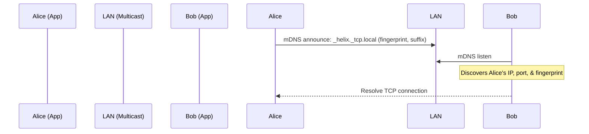
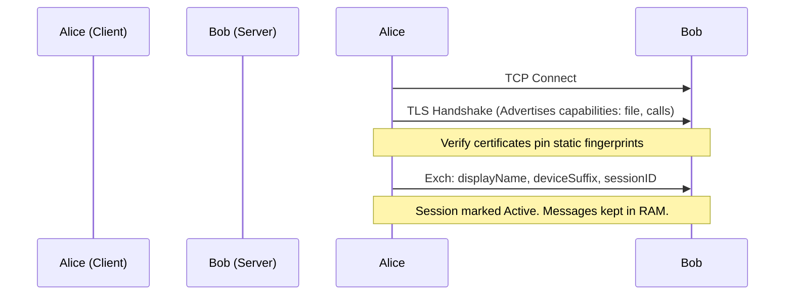

# Helix Local Data Flow

This document maps the network and data pathways of Helix Local.

## 1. Discovery Flow (mDNS & UDP Broadcast)

## 2. Secure Session Establishment

## 3. Ephemeral Media / File Flow
- **Private Media**: Split into chunks -> Encoded in CBOR -> Streamed over secure channel -> Reassembled directly in RAM.
- **Files**: Probed (metadata, size) -> Resumed (chunk index) -> Streamed to `.part` file -> User confirms export -> Moved to OS files -> `.part` deleted.
