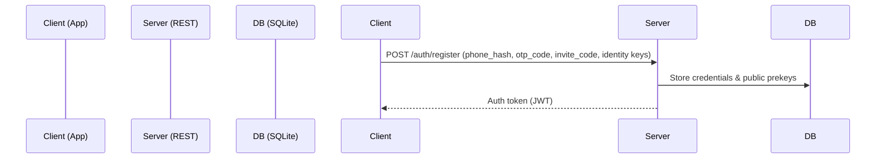
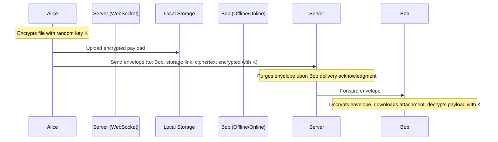

# Helix Remote Data Flow

This document maps the network and data pathways of Helix Remote.

## 1. Registration & Session Sync

```mermaid
sequenceDiagram
    participant Client (App)
    participant Server (REST)
    participant DB (SQLite)

    Client->>Server: POST /auth/register (phone_hash, otp_code, invite_code, identity keys)
    Server->>DB: Store credentials & public prekeys
    Server-->>Client: Auth token (JWT)
```

## 2. E2EE Messaging Flow

```mermaid
sequenceDiagram
    participant Alice
    participant Server (WebSocket)
    participant Local Storage
    participant Bob (Offline/Online)

    Note over Alice: Encrypts file with random key K
    Alice->>Local Storage: Upload encrypted payload
    Alice->>Server: Send envelope (to: Bob, storage link, ciphertext encrypted with K)
    Note over Server: Purges envelope upon Bob delivery acknowledgment
    Server->>Bob: Forward envelope
    Note over Bob: Decrypts envelope, downloads attachment, decrypts payload with K
```
