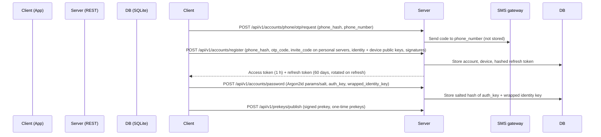
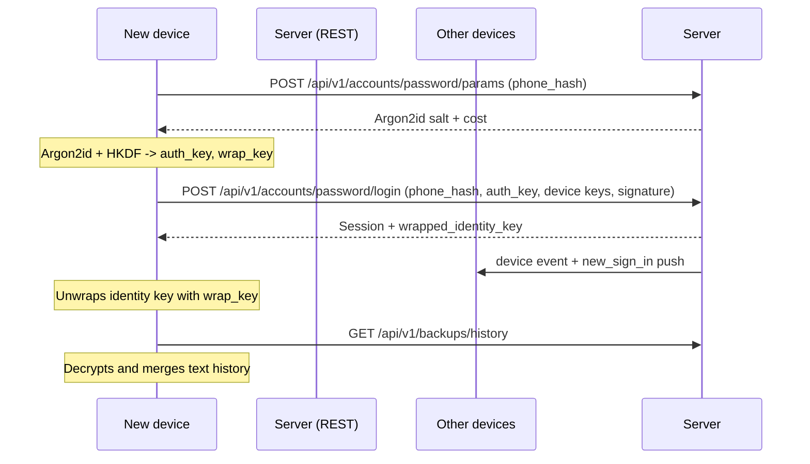
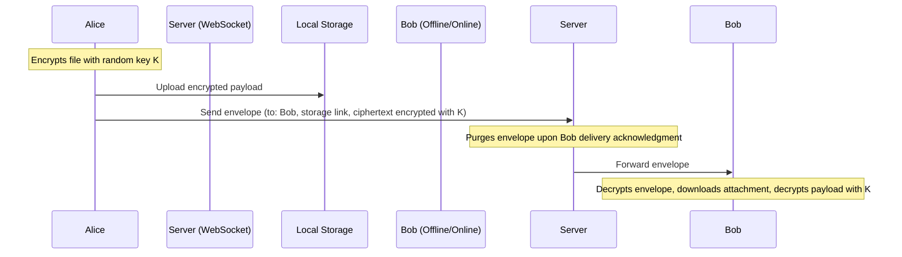

# Helix Remote Data Flow

This document maps the network and data pathways of Helix Remote.

## 1. Registration & Session Sync

Every account must set a password before using the app. The raw phone number
reaches the server only in the OTP request and is forwarded to the SMS gateway.

## 1a. Password Sign-In On Another Device

## 2. E2EE Messaging Flow

