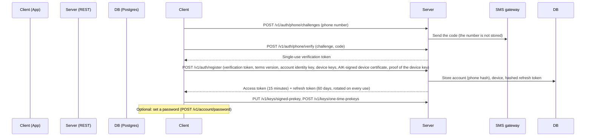
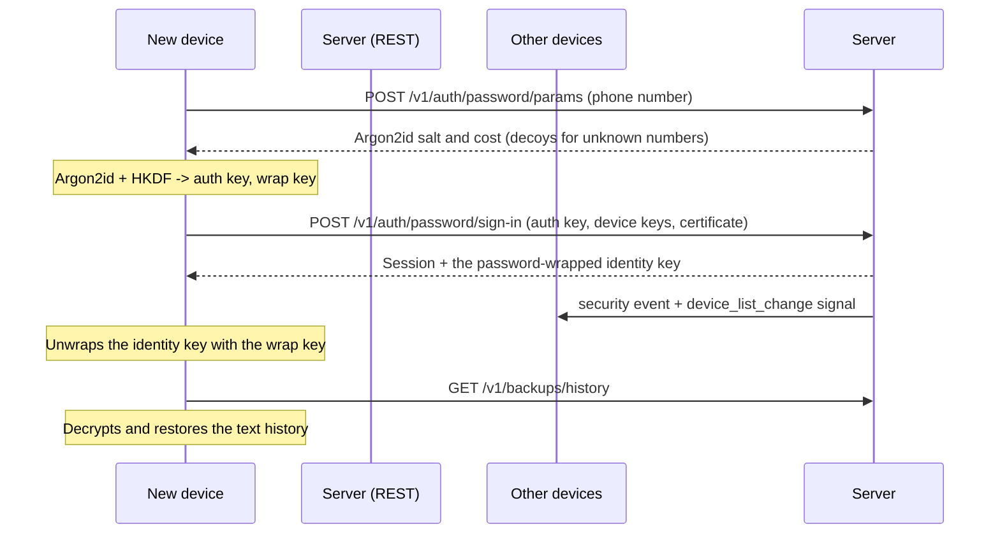
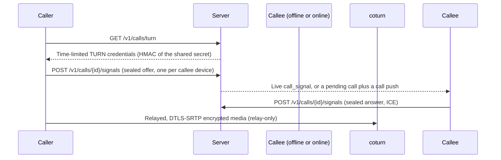

# Helix Remote Data Flow

Status: rewritten at Phase X (2026-10) for the v2 server. Routes are from the route catalog
(`packages/helix_remote_protocol/lib/src/routes.dart`); the formats are in
`docs/protocol/v2/` (REST_V2, REALTIME_V2, CONTENT_V2, CRYPTO_V2). What the server keeps is in
`METADATA_INVENTORY.md`.

This document maps the network and data pathways of Helix Remote.

## 1. Registration and session



The raw phone number reaches the server only in the code request, where it is hashed and
forwarded to the SMS gateway. A personal server registers by invite instead of by SMS.

## 1a. Password sign-in on another device



QR linking is the other way to add a device: the new device shows a code, an existing device
approves it (`POST /v1/devices/links/{link_id}/approve`), and the provisioning data travels
through the server sealed.

## 2. End-to-end encrypted messaging

```mermaid
sequenceDiagram
    participant Alice
    participant Server (REST + WebSocket)
    participant Object storage
    participant Bob (offline or online)

    Alice->>Server: GET /v1/keys/{bob} (once, to start a session)
    Note over Alice: Encrypts any file with a random key K and uploads the ciphertext
    Alice->>Object storage: PUT /v1/media/{id}/content (or a presigned PUT)
    Note over Alice: One sealed envelope per recipient device and per own other device
    Alice->>Server: POST /v1/messages (envelopes, idempotency key, device list)
    Note over Server: Stale device list: 409 device_list_stale. Otherwise one mailbox row per device
    Server-->>Bob: Live frame on the WebSocket, or a data-only push wake-up
    Bob->>Server: GET /v1/mailbox (or the socket replay)
    Note over Bob: Decrypts once into local rows; downloads and decrypts the attachment with K
    Bob->>Server: POST /v1/mailbox/ack (cumulative)
    Note over Server: Deletes the acknowledged mailbox rows
```

Reactions, receipts, edits, deletes, replies, typing, view-once and disappearing timers travel
as encrypted content inside the same envelopes, so the server cannot tell them from messages.
Group messages use Sender Keys: a sender key is distributed over the pairwise sessions, then
`POST /v1/groups/{group_id}/messages` sends one ciphertext that the server fans out per member
device.

## 3. Calls


